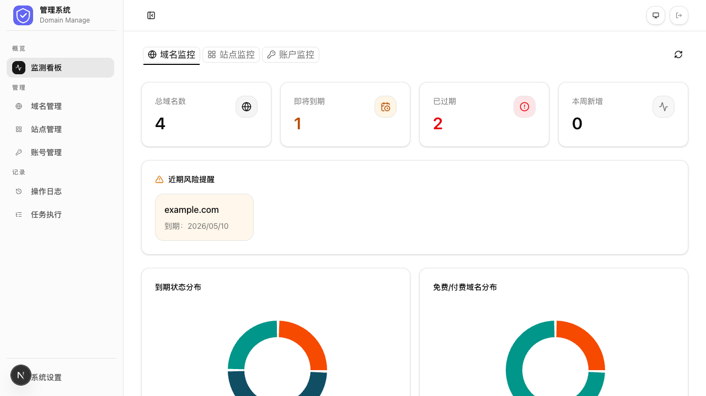
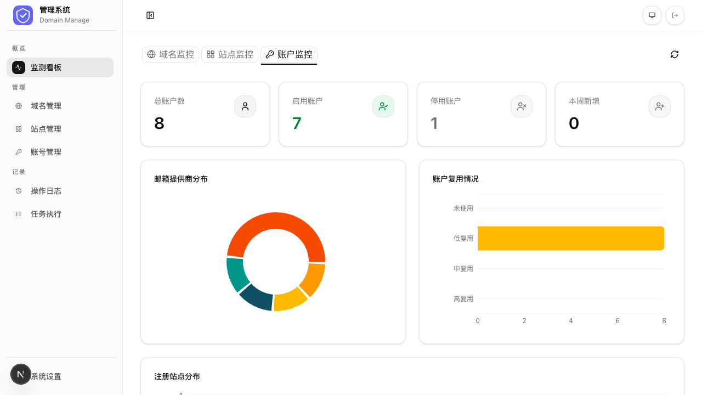
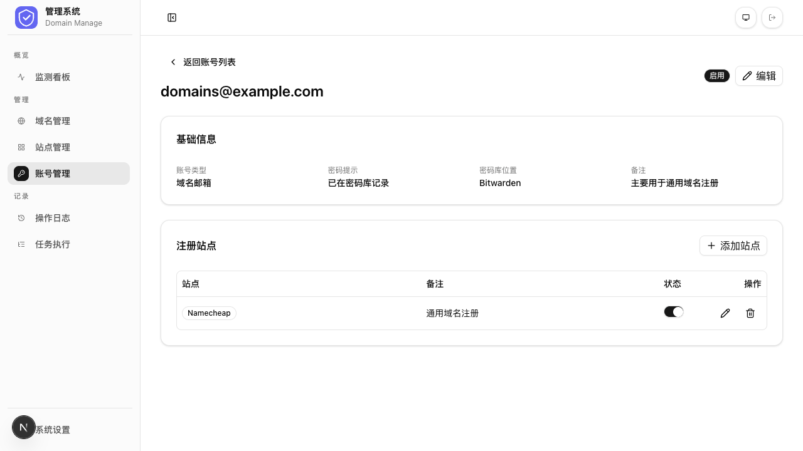
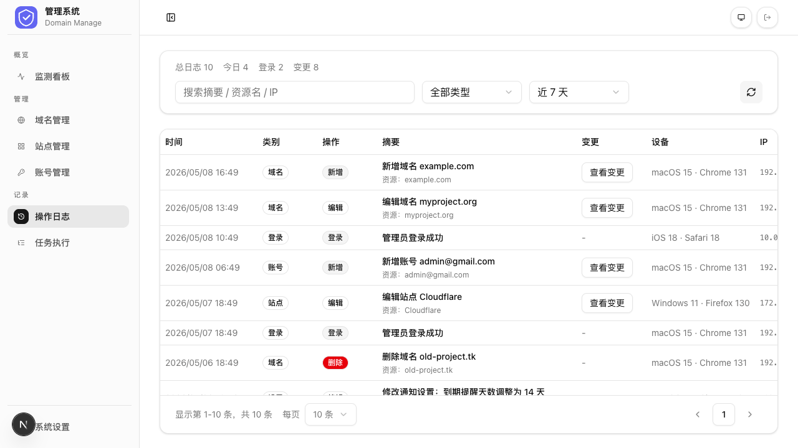
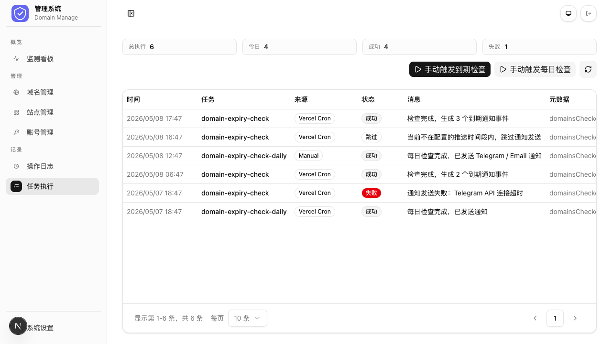

# 域名管理平台 — 后台功能使用文档

---

## 1. 登录 (`/login`)

**功能**：通过访问秘钥验证身份，是进入管理后台的唯一入口。

**特色**：支持密文/明文切换查看秘钥、记住秘钥自动填充、已登录用户自动跳转仪表盘。

---

## 2. 看板 (`/dashboard`)

**功能**：以统计卡片和图表展示域名、站点、账户三大维度的全局数据。

**特色**：三个标签页自由切换，图表支持点击跳转到对应筛选列表，风险域名和风险账户主动预警。

---

## 3. 域名管理 (`/domains`)

**功能**：集中管理所有域名的注册信息、到期时间、DNS 归属和费用，支持子域名管理。

**特色**：域名状态自动推导（正常/即将到期/已过期），多维度筛选排序，自定义显示列，批量操作。

---

## 4. 站点管理 (`/sites`)

**功能**：维护所有第三方服务站点（注册商、DNS 等），供域名和账户模块关联引用。

**特色**：表格/卡片双视图，常用站点收藏拖拽排序，启用/停用直接开关控制。

---

## 5. 账户管理 (`/accounts`)

**功能**：管理所有第三方平台账号，维护账号与站点的关联关系。

**特色**：账号标识与绑定邮箱分离，密码提示和密码库位置辅助记忆，被引用的账号受保护无法删除。

---

## 6. 设置与通知 (`/settings`)

**功能**：配置平台品牌信息、通知偏好规则及三大通知通道（Telegram / Email / Webhook）。

**特色**：项目图标实时预览，通知规则按资源类型分组控制，三大通道均支持测试发送验证连通性。

---

## 7. 操作记录 (`/logs`)

**功能**：记录全平台所有操作行为，支持按类别和时间范围筛选。

**特色**：编辑类操作可查看逐字段的变更前后对比，记录操作设备和 IP 便于审计追溯。

---

## 8. 任务执行记录 (`/job-runs`)

**功能**：查看域名到期检查等定时任务的执行历史，并支持手动触发任务。

**特色**：内置域名到期每日检查定时任务，记录每次检查的域名数和通知事件数，支持手动触发即时执行无需等待调度。

