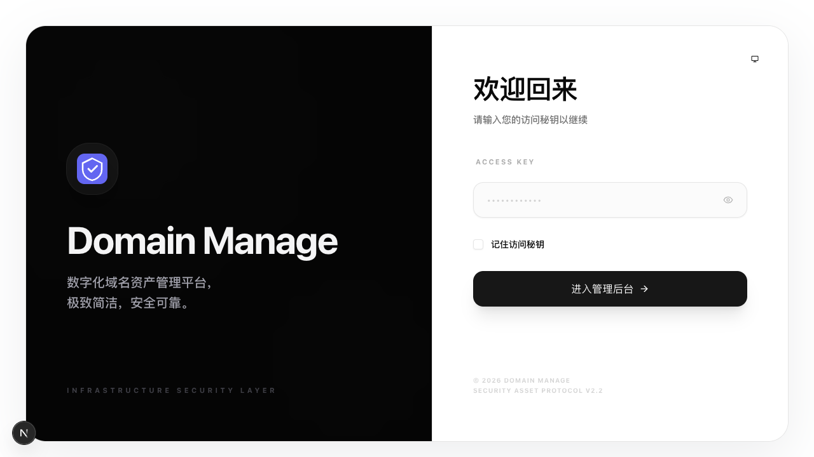
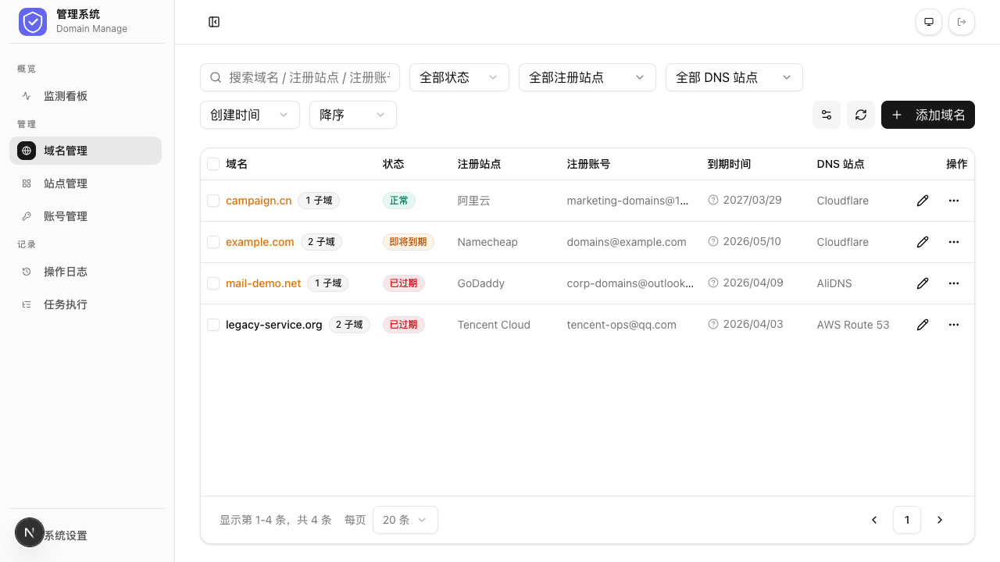
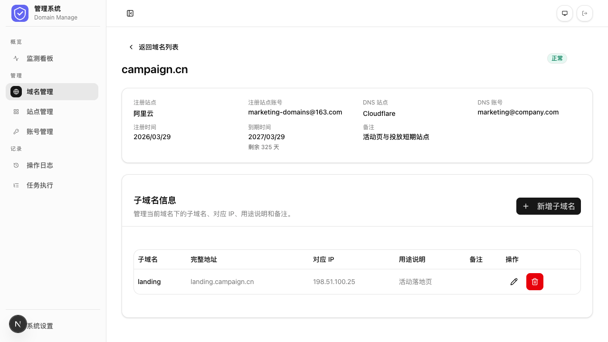
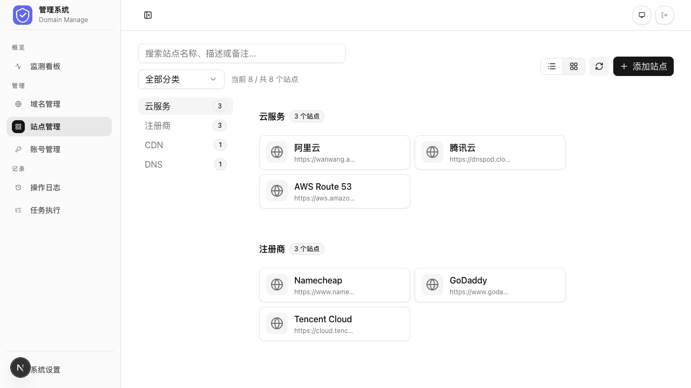
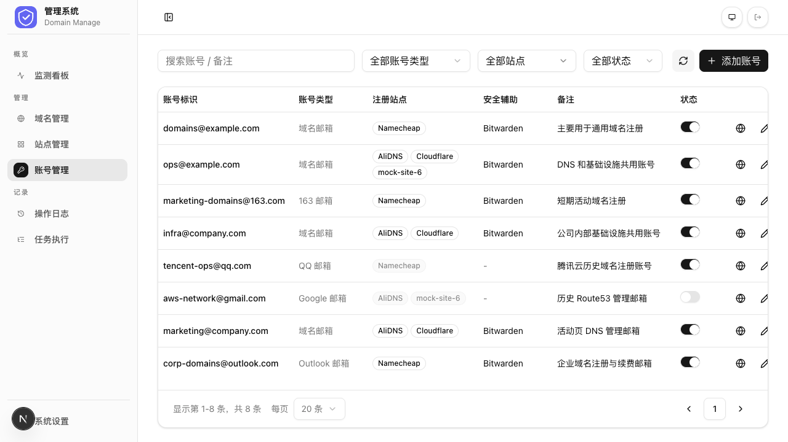
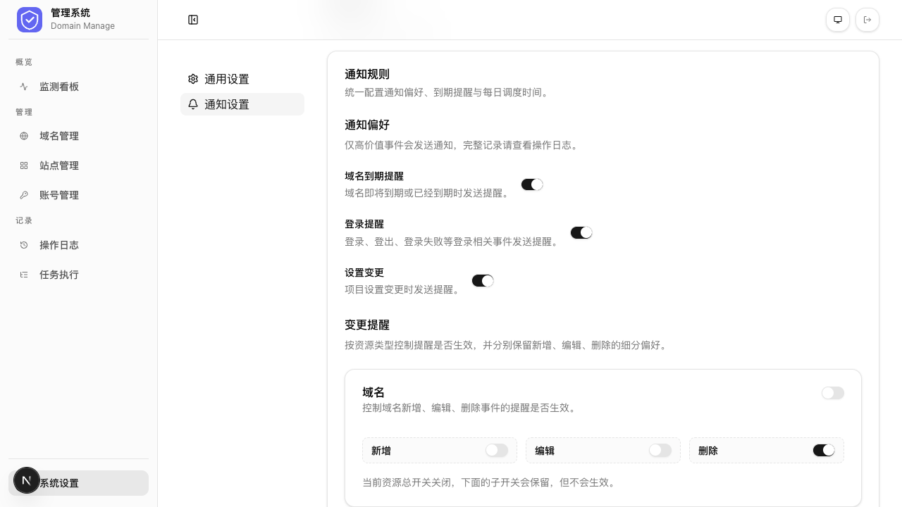

# Domain Manage

基于 Next.js App Router + Supabase 的域名管理平台，用来统一管理域名、站点、账号、通知与到期巡检任务。

## 功能概览

- 域名管理：维护域名信息、子域名、注册/到期时间与关联站点
- 站点管理：维护站点分类、状态与常用站点
- 账号管理：维护账号信息、绑定站点与启用状态
- 监测看板：查看域名、站点、账号相关统计与图表
- 操作日志：记录登录和关键业务操作
- 任务执行：查看定时任务与手动任务执行记录
- 通知配置：支持 Telegram、Email、Webhook 通知与测试发送
- 访问控制：通过访问秘钥登录，服务端写入会话

## 技术栈

- Next.js App Router
- TypeScript
- Supabase
- React Hook Form
- Zod
- Recharts
- Tailwind CSS
- shadcn/ui

## 页面入口

- `/dashboard`：监测看板
- `/domains`：域名管理
- `/domains/[domainId]`：域名详情
- `/sites`：站点管理
- `/accounts`：账号管理
- `/accounts/[accountId]`：账号详情
- `/logs`：操作日志
- `/job-runs`：任务执行记录
- `/settings`：系统设置
- `/login`：登录页

说明：根路径 `/` 会重定向到 `/dashboard`。

## 页面功能说明

### 登录 (`/login`)

通过访问秘钥验证身份，支持密文/明文切换、记住秘钥自动填充。



### 看板 (`/dashboard`)

统计卡片和图表展示域名、站点、账户全局数据，三个标签页切换，图表点击跳转到对应筛选列表。


### 域名管理 (`/domains`)

集中管理域名注册信息、到期时间、DNS 归属和费用，支持子域名管理。状态自动推导，多维度筛选排序，批量操作。





### 站点管理 (`/sites`)

维护第三方服务站点（注册商、DNS 等），表格/卡片双视图，常用站点收藏拖拽排序。



### 账户管理 (`/accounts`)

管理第三方平台账号及站点关联，账号标识与绑定邮箱分离，密码提示辅助记忆。




### 设置与通知 (`/settings`)

配置项目品牌信息、通知偏好规则及三大通知通道（Telegram / Email / Webhook），均支持测试发送。



### 操作记录 (`/logs`)

全平台操作审计追踪，按类别和时间筛选，编辑操作可查看字段变更前后对比。


### 任务执行记录 (`/job-runs`)

域名到期每日检查定时任务的执行历史，记录检查域名数和通知事件数，支持手动触发。


## 本地开发

### 1. 安装依赖

```bash
npm install
```

### 2. 配置环境变量

复制 `.env.example` 为 `.env.local`，并填写：

```env
NEXT_PUBLIC_SUPABASE_URL=
NEXT_PUBLIC_SUPABASE_ANON_KEY=
SUPABASE_SERVICE_ROLE_KEY=
ACCESS_KEY=
ACCESS_SESSION_SIGNING_KEY=
ACCESS_SESSION_MAX_AGE_SECONDS=28800
CRON_SECRET=
```

变量说明：

- `NEXT_PUBLIC_SUPABASE_URL`：Supabase Project URL
- `NEXT_PUBLIC_SUPABASE_ANON_KEY`：Supabase 匿名密钥，仅客户端使用
- `SUPABASE_SERVICE_ROLE_KEY`：Supabase 服务端密钥，仅服务端使用
- `ACCESS_KEY`：登录访问秘钥
- `ACCESS_SESSION_SIGNING_KEY`：访问会话签名密钥，建议至少 32 位随机字符
- `ACCESS_SESSION_MAX_AGE_SECONDS`：访问会话有效期，默认 8 小时
- `CRON_SECRET`：Vercel Cron 调用 `/api/cron/*` 时的鉴权密钥

### 3. 初始化 Supabase

在 Supabase SQL Editor 中执行：

- `supabase/schema.sql`

如果已经有历史环境，也可以按需执行 `supabase/migrations/*` 中的迁移脚本。

### 4. 启动开发环境

```bash
npm run dev
```

## 构建与检查

```bash
npm run lint
npm run build
```

## 定时任务

当前项目内置两个域名巡检 job：

- `domain-expiry-check`：保留按小时唤醒后再判断 `notifyTimezone + notifyHour` 的旧模式
- `domain-expiry-check-daily`：给 Vercel Cron 每天触发一次的日巡检模式

CLI 手动运行示例：

```bash
npm run job -- domain-expiry-check
npm run job -- domain-expiry-check-daily
```

手动触发来源也会记录到 `job_runs.trigger_source`。

## 部署到 Vercel

### 1. 创建 Supabase 项目

创建 Supabase 项目后，执行 `supabase/schema.sql` 初始化数据库。

### 2. 在 Vercel 配置环境变量

至少配置以下变量：

- `NEXT_PUBLIC_SUPABASE_URL`
- `NEXT_PUBLIC_SUPABASE_ANON_KEY`
- `SUPABASE_SERVICE_ROLE_KEY`
- `ACCESS_KEY`
- `ACCESS_SESSION_SIGNING_KEY`
- `ACCESS_SESSION_MAX_AGE_SECONDS`
- `CRON_SECRET`

### 3. 导入仓库并部署

将仓库连接到 Vercel 后直接部署即可，构建命令与输出目录使用 Next.js 默认配置。

### 4. 配置 Vercel Cron

仓库根目录已提供 `vercel.json`，当前配置如下：

- 路径：`/api/cron/domain-expiry-check-daily`
- 调度：`5 1 * * *`
- 语义：按 UTC 解释时，对应上海时间每天 09:05 触发一次

项目中的 cron 路由会校验 `Authorization: Bearer $CRON_SECRET`，因此需要在 Vercel 中同步配置 `CRON_SECRET`。

## 相关文件

- `vercel.json`：Vercel Cron 配置
- `app/api/cron/domain-expiry-check-daily/route.ts`：Vercel 日巡检入口
- `app/api/cron/domain-expiry-check/route.ts`：兼容旧模式的 cron 入口
- `lib/jobs/domain-expiry-check.ts`：域名巡检业务核心
- `scripts/run-job.ts`：CLI job 入口
- `.env.example`：环境变量模板

## 说明

当前仅支持 Vercel 部署，其他平台暂未支持。